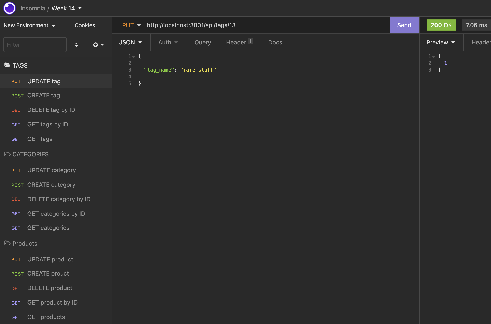
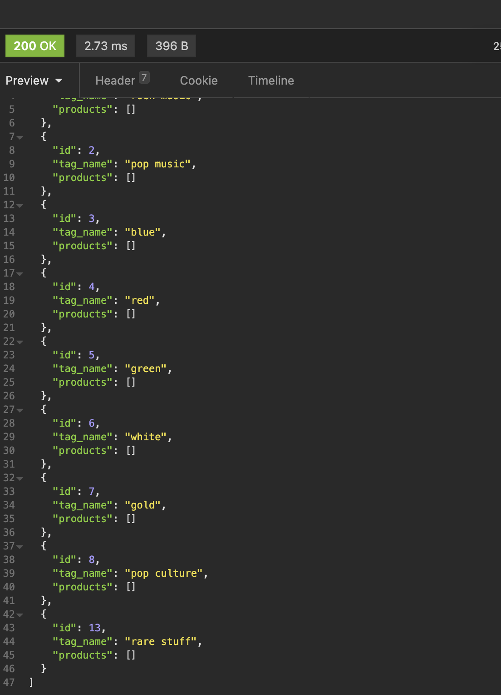

# e-commerce-

# Description
Back end app for e-commerce selling website

# Video link

link https://watch.screencastify.com/v/mfkH7YPFcoHn6GDssTy3

# Installation 
You'll need to download and use the MySQL2 and Sequelize packages to connect to your Express.js API to a Mysql database and the dotenv package for storing sensitive data

# Usage 
Internet retail, also known as e-commerce, is the largest sector of the electronics industry, generating an estimated $29 trillion in 2019. E-commerce platforms like Shopify and WooCommerce provide a suite of services to businesses of all sizes. We can use this app to track products, tags, and categories of items.

# User Story 
AS A manager at an internet retail company
I WANT a back end for my e-commerce website that uses the latest technologies
SO THAT my company can compete with other e-commerce companies

# Acceptance Criteria 
GIVEN a functional Express.js API
WHEN I add my database name, MySQL username, and MySQL password to an environment variable file
THEN I am able to connect to a database using Sequelize
WHEN I enter schema and seed commands
THEN a development database is created and is seeded with test data
WHEN I enter the command to invoke the application
THEN my server is started and the Sequelize models are synced to the MySQL database
WHEN I open API GET routes in Insomnia Core for categories, products, or tags
THEN the data for each of these routes is displayed in a formatted JSON
WHEN I test API POST, PUT, and DELETE routes in Insomnia Core
THEN I am able to successfully create, update, and delete data in my database

# Contributing 
Luke Stewart

# Tests 
Insomnia used to test API routes

# Screen Shots 

# Github
L-Stew206

# Email
lukeconrad.stew@gmail.com

# License
None
